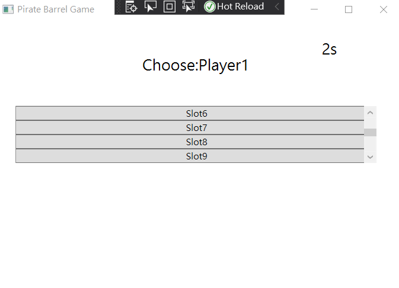

# Pirate Barrel Game

  

Main window, there are three options to choose. You only can select one option due to I use the radio button.

  

Suppose I select “Two players” option.

  

Then, enter the game. Player1 and player2 will be displayed in turn. You can see that the first operation below is player1.

  

Also, these slots can slide up and down, showing four slots at a time. There are total twelve slots.

  

At the same time, you can see a countdown clock in the upper right corner. Each player has 10 seconds of operation time (9s to 0s, total 10 seconds). If player do not select slot for more than 10 seconds, he/she will automatically be judged as a loser.

  

When player1 click the Slot2, it will hidden. Then it is player2's turn to choose, the page below is in the player2 selection stage. 

  

## Game over example one (time out)
When player2 is selected, it is player1's turn. When player1 is not selected for more than 10 seconds, the page will pop up Canvas, and the player1 will automatically be judged as a loser. We can also see that the time in the upper right corner is already 0 seconds. At the same time, you can also see below showing that who is the loser.

  

## Game over example two (hit the slot)
If player1 "hits the spot", he will also become a loser. At this time, the screen will still jump to the next player operation interface. We can see that the time in the upper right corner is still at 8 seconds (It means that the player has operated in a limited time), and the lower part shows that the loser is player1. The player2 in the selection phase at the top is not meaningful to select again.

  

### The operation method of three players and four players options is the same as above. Enjoy the game!

## NOTE: For game over example one and two, if the message showing the loser blow does not appear on the screen, please try again. This is because sometimes the operation is too fast.